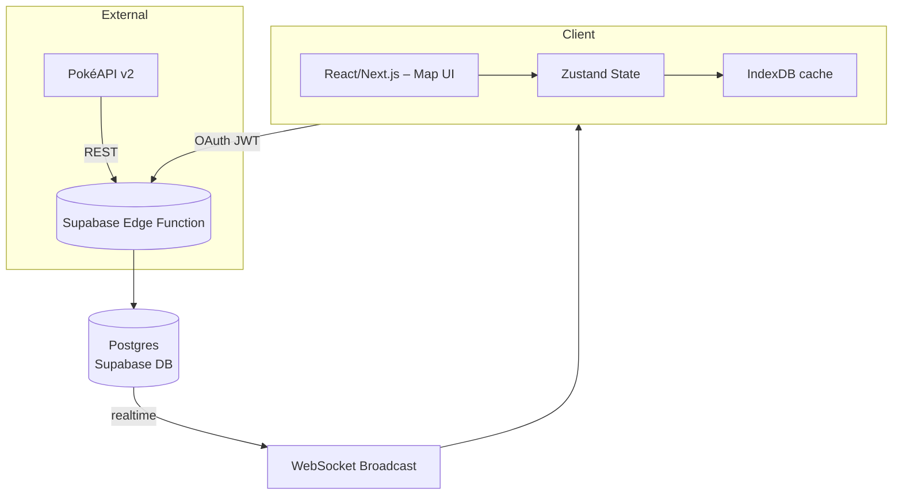

# System Architecture & Data Models

## 7 · System Architecture



* **Frontend** – React 18 + Next.js 14 (App Router), Tailwind CSS.  
* **State** – Zustand with persistence middleware.  
* **Maps** – Pre‑built SVGs in `/public/maps`.  
* **Backend** – Supabase (Auth + Postgres + Realtime).  
* **Hosting** – Vercel (Next) + Supabase (DB).

---

## 8 · Core Data Models (TypeScript)

```ts
type Run = {
  id: string;
  game: GameId;            // "FR" | "HGSS" | "SV" | …
  mode: "standard" | "randomized";
  createdAt: string;       // ISO
  updatedAt: string;
  players: Player[];
  rules: RunRules;
  encounters: Encounter[];
  badges: Badge[];
};

type Player = {
  id: string;
  name: string;
  color: string;           // HEX
  avatarUrl?: string;
};

type Encounter = {
  id: string;
  areaId: string;          // map layer id
  playerId: string;
  pokemonId: number;       // National Dex #
  nickname?: string;
  status: "alive" | "dead" | "boxed" | "released";
  level: number;
  method: "grass" | "surf" | "oldRod" | "gift" | …;
  linkedEncounterIds: string[];
  isValid: boolean;
};

type RunRules = {
  dupesClause: boolean;
  speciesClause: boolean;
  shinyClause: boolean;
  setMode: boolean;
  levelCapEnforced: boolean;
};

type Badge = {
  id: string;
  name: string;
  obtainedAt?: string;
  levelCap: number;
};
```
